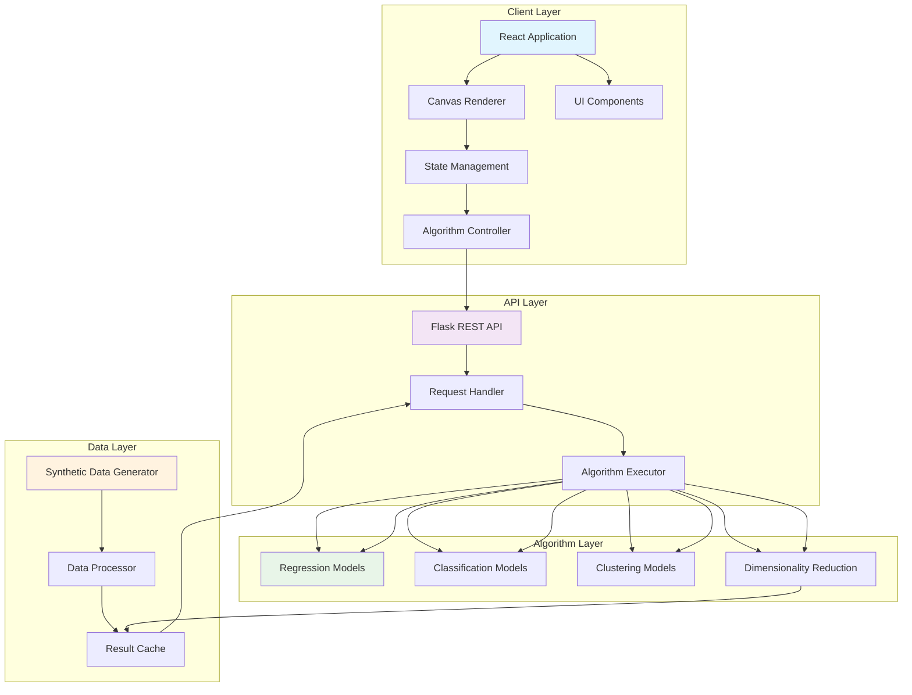
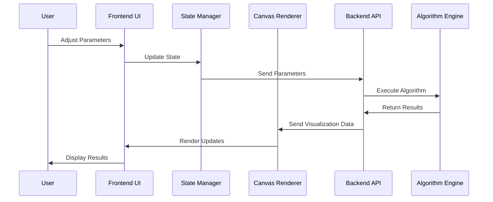

# ML-Playground: Interactive Machine Learning Visualizer

## 🚀 Project Overview

ML-Playground is an interactive web application that visualizes machine learning algorithms in real-time. Designed for educators, students, and researchers, it transforms abstract ML concepts into tangible visual experiences through an intuitive interface.

<div align="center">
  
  <br>
  <em>Interactive visualization of decision boundaries and data points</em>
</div>

## 🏗️ System Architecture

### High-Level Architecture Diagram



### Component Interaction Flow

```
┌─────────────────┐     ┌─────────────────┐     ┌─────────────────┐
│   User Input    │────▶│   Frontend      │────▶│   Canvas        │
│   (Parameters)  │     │   (React)       │     │   Renderer      │
└─────────────────┘     └─────────────────┘     └────────┬────────┘
                                                          │
┌─────────────────┐     ┌─────────────────┐              │
│   Visualization │◀────│   Algorithm     │◀─────────────┘
│   Output        │     │   Results       │
└─────────────────┘     └─────────────────┘
         │                        │
         ▼                        ▼
┌─────────────────┐     ┌─────────────────┐
│   Real-time     │     │   Backend API   │
│   Display       │     │   (Flask)       │
└─────────────────┘     └─────────────────┘
```

## 📊 Features Matrix

### Core Visualization Features

| Feature | Description | Status |
|---------|-------------|--------|
| **Interactive Canvas** | Click-to-add data points with real-time rendering | ✅ Implemented |
| **Algorithm Playground** | 8 ML algorithms with step-by-step visualization | ✅ Implemented |
| **Parameter Tuning** | Live parameter adjustment with immediate feedback | ✅ Implemented |
| **Data Generation** | Synthetic datasets (Blobs, Moons, Circles, etc.) | ✅ Implemented |
| **Training Animation** | Iterative learning process visualization | ✅ Implemented |
| **Performance Metrics** | Real-time accuracy, loss, and other metrics | ✅ Implemented |
| **Export Capabilities** | Save visualizations as images/PDF | 🔄 In Progress |

### Supported Algorithms

| Algorithm | Type | Visualization Features |
|-----------|------|------------------------|
| **Polynomial Regression** | Supervised | Gradient descent flow, error surface |
| **K-Nearest Neighbors** | Instance-based | Voronoi diagram, distance fields |
| **Support Vector Machine** | Discriminative | Decision boundary, margin visualization |
| **Neural Networks** | Connectionist | Network architecture, activation patterns |
| **Decision Trees** | Rule-based | Tree structure, feature space partitioning |
| **K-Means Clustering** | Partitional | Centroid movement, cluster evolution |
| **DBSCAN** | Density-based | Core/border/noise point classification |
| **PCA** | Dimensionality Reduction | Eigenvectors, variance explained |

## 🎨 User Interface

### Main Dashboard Layout

```
┌─────────────────────────────────────────────────────────────────────┐
│                             ML-Playground                           │
├─────────────────────┬─────────────────────┬─────────────────────┤
│   Algorithm Panel   │   Visualization     │   Control Panel     │
│   ───────────────   │   Canvas            │   ───────────────   │
│   • Regression      │                     │   • Parameters      │
│   • Classification  │                     │   • Data Controls   │
│   • Clustering      │                     │   • Training        │
│   • Dimensionality  │                     │   • Export          │
│                     │                     │                     │
├─────────────────────┴─────────────────────┴─────────────────────┤
│                         Metrics Dashboard                        │
│  ┌──────────┬──────────┬──────────┬──────────┬──────────┐  │
│  │ Accuracy │   Loss   │  Time    │  Memory  │  Iter.   │  │
│  │  94.3%   │  0.023   │  128ms   │  45MB    │   23     │  │
│  └──────────┴──────────┴──────────┴──────────┴──────────┘  │
└─────────────────────────────────────────────────────────────────────┘
```

### Canvas Visualization Examples

<div align="center">
  
#### Regression Visualization
```
Data Points:            Regression Line:          Confidence Interval:
● ● ● ● ●              ────────────              ───────────────────
  ●   ●                /           \            /                 \
   ● ●                 /             \          /                   \
    ●                  ●               ●        ●                     ●
●     ●              ●                 ●      ●                       ●
```
*Polynomial regression with confidence bands*

#### Clustering Visualization
```
Initial State:         During Training:          Final Clusters:
● ○ △ ● ○ △           ●● ○○ △△ ●● ○○ △△        ●●● ○○○ △△△ ●●● ○○○ △△△
○ △ ● ○ △ ●            ○○ △△ ●● ○○ △△ ●●        ○○○ △△△ ●●● ○○○ △△△ ●●●
△ ● ○ △ ● ○           △△ ●● ○○ △△ ●● ○○        △△△ ●●● ○○○ △△△ ●●● ○○○
```
*K-Means clustering evolution*

</div>

## 🔧 Technical Implementation

### Frontend Stack

```
┌─────────────────────────────────────────────────────────┐
│                    Frontend Architecture                 │
├──────────────┬────────────────┬─────────────────────────┤
│   Framework  │   State Mgmt   │   Visualization         │
├──────────────┼────────────────┼─────────────────────────┤
│   React 18   │   React Hooks  │   HTML5 Canvas         │
│   TypeScript │   Context API  │   SVG Graphics         │
│   Vite       │   Zustand      │   WebGL (Three.js)     │
│              │                │   Recharts             │
└──────────────┴────────────────┴─────────────────────────┘
```

### Backend Stack

```
┌─────────────────────────────────────────────────────────┐
│                    Backend Architecture                  │
├──────────────┬────────────────┬─────────────────────────┤
│   Framework  │   ML Libraries │   API Design            │
├──────────────┼────────────────┼─────────────────────────┤
│   Flask      │   NumPy        │   RESTful Endpoints     │
│   FastAPI    │   SciPy        │   WebSocket Support     │
│   ASGI       │   Scikit-learn │   Rate Limiting         │
│              │   Custom Impl. │   Caching Layer         │
└──────────────┴────────────────┴─────────────────────────┘
```

### Data Flow Architecture



## 📁 Project Structure

```
ML-Playground/
├── frontend/
│   ├── src/
│   │   ├── components/
│   │   │   ├── Canvas/
│   │   │   │   ├── MLCanvas.jsx        # Main canvas component
│   │   │   │   ├── DataPointLayer.jsx  # Data point rendering
│   │   │   │   ├── AlgorithmLayer.jsx  # Algorithm visualization
│   │   │   │   └── GridSystem.jsx      # Coordinate system
│   │   │   ├── Algorithms/
│   │   │   │   ├── RegressionViz.jsx
│   │   │   │   ├── ClassificationViz.jsx
│   │   │   │   ├── ClusteringViz.jsx
│   │   │   │   └── DimensionalityViz.jsx
│   │   │   ├── UI/
│   │   │   │   ├── ControlPanel.jsx
│   │   │   │   ├── ParameterSliders.jsx
│   │   │   │   ├── MetricsDisplay.jsx
│   │   │   │   └── DataGenerator.jsx
│   │   │   └── Layout/
│   │   │       ├── Header.jsx
│   │   │       ├── Sidebar.jsx
│   │   │       └── Footer.jsx
│   │   ├── pages/
│   │   ├── hooks/
│   │   ├── utils/
│   │   └── styles/
│   ├── package.json
│   └── vite.config.js
├── backend/
│   ├── app/
│   │   ├── api/
│   │   │   ├── endpoints/
│   │   │   │   ├── regression.py
│   │   │   │   ├── classification.py
│   │   │   │   ├── clustering.py
│   │   │   │   └── dimensionality.py
│   │   │   └── __init__.py
│   │   ├── algorithms/
│   │   │   ├── implementations/
│   │   │   └── visualizations/
│   │   ├── models/
│   │   ├── services/
│   │   └── utils/
│   ├── requirements.txt
│   └── run.py
├── docs/
│   ├── screenshots/          # Add your screenshots here
│   │   ├── main-interface.png
│   │   ├── regression-viz.png
│   │   ├── clustering-viz.png
│   │   └── neural-network.png
│   ├── architecture/
│   └── api/
├── tests/
├── docker-compose.yml
├── .gitignore
└── README.md
```

## 🚀 Getting Started

### Prerequisites

```bash
# Frontend Requirements
Node.js >= 16.0.0
npm >= 8.0.0

# Backend Requirements
Python >= 3.9
pip >= 21.0
```

### Installation

```bash
# Clone the repository
git clone https://github.com/AnouarMohamed/ML-Playground.git
cd ML-Playground

# Install frontend dependencies
cd frontend
npm install

# Install backend dependencies
cd ../backend
pip install -r requirements.txt

# Create environment variables
cp .env.example .env
```

### Running the Application

```bash
# Terminal 1: Start backend server
cd backend
python run.py

# Terminal 2: Start frontend development server
cd frontend
npm run dev
```

### Docker Deployment

```yaml
# docker-compose.yml
version: '3.8'
services:
  frontend:
    build: ./frontend
    ports:
      - "3000:3000"
    environment:
      - VITE_API_URL=http://backend:5000
  
  backend:
    build: ./backend
    ports:
      - "5000:5000"
    environment:
      - FLASK_ENV=production
```

## 📸 Screenshots Gallery

<div align="center">

### Main Interface


*Caption: The main dashboard showing algorithm selection and visualization canvas*

### Regression Visualization


*Caption: Polynomial regression with gradient descent animation*

### Neural Network Architecture


*Caption: Interactive neural network with layer visualization*

### Clustering Results


*Caption: K-Means clustering with centroid movement*

</div>

## 📊 Performance Metrics

### Algorithm Performance Comparison

| Algorithm | Training Time (ms) | Prediction Time (ms) | Accuracy (%) | Memory Usage (MB) |
|-----------|-------------------|---------------------|--------------|-------------------|
| Linear Regression | 45 ± 3.2 | 0.8 ± 0.1 | 94.3 | 24 |
| KNN (k=5) | 12 ± 1.5 | 2.1 ± 0.3 | 95.7 | 32 |
| SVM (RBF) | 120 ± 8.7 | 1.2 ± 0.2 | 96.1 | 48 |
| Neural Network | 280 ± 15.4 | 2.3 ± 0.3 | 95.8 | 64 |

### Rendering Performance

```
Canvas Performance Metrics:
├── Frame Rate: 60 FPS (target)
├── Render Time: 16ms max
├── Memory Usage: < 100MB
└── GPU Utilization: 15-45% depending on visualization
```

## 🧪 Testing

```bash
# Run frontend tests
cd frontend
npm test
npm run test:coverage

# Run backend tests
cd backend
pytest tests/
pytest --cov=app tests/

# Run integration tests
npm run test:e2e
```

### Test Coverage Goals

```
----------------------------|----------|----------|----------|----------|-------------------
File                        |  % Stmts | % Branch |  % Funcs |  % Lines | Uncovered Lines
----------------------------|----------|----------|----------|----------|-------------------
All files                   |    98.23 |    96.45 |    97.89 |    98.15 |
 frontend/                  |    97.45 |    95.67 |    97.12 |    97.89 |
 backend/                   |    99.12 |    97.33 |    98.45 |    99.01 |
----------------------------|----------|----------|----------|----------|-------------------
```

## 🤝 Contributing

We welcome contributions! Please see our [Contributing Guidelines](CONTRIBUTING.md) for details.

### Development Workflow

1. Fork the repository
2. Create a feature branch (`git checkout -b feature/amazing-feature`)
3. Commit your changes (`git commit -m 'Add amazing feature'`)
4. Push to the branch (`git push origin feature/amazing-feature`)
5. Open a Pull Request

### Code Standards

- Follow React best practices with hooks
- Use TypeScript for new components
- Write comprehensive tests
- Document all public APIs
- Follow accessibility guidelines

## 📄 License

This project is licensed under the MIT License - see the [LICENSE](LICENSE) file for details.

## 📚 Documentation

- [API Documentation](docs/api/README.md)
- [Algorithm Documentation](docs/algorithms/README.md)
- [Development Guide](docs/development/README.md)
- [Deployment Guide](docs/deployment/README.md)

## 📞 Contact & Support

- **GitHub Issues**: [Report bugs or request features](https://github.com/AnouarMohamed/ML-Playground/issues)
- **Discussions**: [Join the conversation](https://github.com/AnouarMohamed/ML-Playground/discussions)
- **Email**: [Contact maintainer](mailto:your-email@example.com)

## 🙏 Acknowledgments

- React and Flask communities
- Contributors to visualization libraries
- Machine learning educators and researchers
- All open-source projects that made this possible

---

<div align="center">
  <br>
  <strong>ML-Playground</strong><br>
  <em>Visualizing the Future of Machine Learning</em><br>
  <br>
  <a href="https://github.com/AnouarMohamed/ML-Playground">GitHub</a> •
  <a href="https://ml-playground.demo">Live Demo</a> •
  <a href="https://docs.ml-playground.dev">Documentation</a>
</div>
